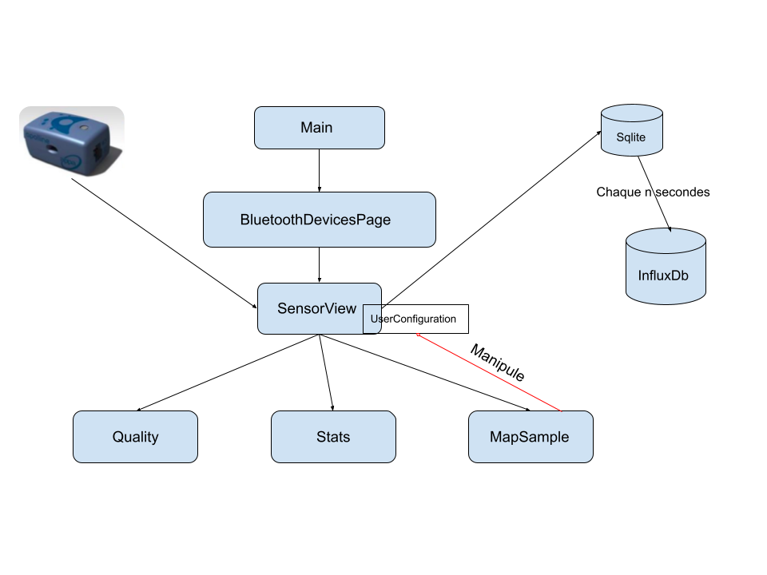

# Mode d'emploi

## Installation
---------------
<br/>

Pour faire tourner ce projet, il faudrait disposer d'un capteur bleu [LOA](http://www-loa.univ-lille1.fr/), d'un téléphone android en mode développeur et d'un ordinateur pour Installer [flutter](https://flutter.dev/docs/get-started/install) et [dart](https://dart.dev/get-dart), télécharger le projet [apolline-backend-ng](https://github.com/Apolline-Lille/apolline-backend-ng) et réussir à le faire tourner. Utiliser un IDE comme recommandé dans ce [lien](https://flutter.dev/docs/get-started/editor) ou taper les commandes suivantes dans le dossier où se trouve le projet.

```bash
cd /apolline-flutter/apolline-flutter
flutter devices //pour vérifier si votre appareil android est reconnu
flutter run //pour faire tourner la simulation.
```

## Backend configuration generation

Before running the application, you MUST generate endpoint configuration by running:
```shell script
dart scripts/configuration_generation.dart
```
Then, you can set variables in the `apolline-flutter/assets/cfg/config_dev.json` file.


## Structuration du projet
--------------------------
<br/>

Après le téléchargement du projet, vous aurez une structure qui ressemble comme ci dessus.

```
apolline-flutter/
└── apolline-flutter/
   ├── android/
       ├── ...
   ├── assets/
       ├── ...
   ├── ios/
       ├── ...
   ├── lib/
       ├── exception/
       ├── models/
       ├── services/
       ├── utils/
       ├── widgets/
       ├── main.dart
       ├── ...
   ├── test/
   └── assets/

```

Le développement est fait principalement dans le dossier *lib*, avec quelque manipulation sur les dossier *android*, *ios*, pour toutes les configurations demandés par les différents plugins que nous utilisons.

- Le dossier *assets/cfg* contient la configuration nécéssaire pour l'application apolline
    - **api_url**: qui correspond à l'url ou l'adresse ip sur lequel serrait entrain de tourner le projet [apolline-backend-ng](https://github.com/Apolline-Lille/apolline-backend-ng).
    - **ping_url**: la même url que plus haut, pour nous permettre de savoir si une instance de ce projet [apolline-backend-ng](https://github.com/Apolline-Lille/apolline-backend-ng) est entrain de tourner.
    - **password**: le mot de passe passe lié à l'instance [apolline-backend-ng](https://github.com/Apolline-Lille/apolline-backend-ng).
    - **username**: l'utilisateur lié à l'instance [apolline-backend-ng](https://github.com/Apolline-Lille/apolline-backend-ng).
    - **dbname**: le nom de la base lié à l'instance [apolline-backend-ng](https://github.com/Apolline-Lille/apolline-backend-ng).
    - **minPmValues**: les valeurs minimales des *pm* suivant l'orde du *SensorModel* comme 0 -> SENSOR_PM_1, 1 -> SENSOR_PM_2_5, 2 -> SENSOR_PM_10, 3 -> SENSOR_PM_ABOVE_0_3, 4 -> SENSOR_PM_ABOVE_0_5, 5 -> SENSOR_PM_ABOVE_1, 6 -> SENSOR_PM_ABOVE_2_5, 7 -> SENSOR_PM_ABOVE_5, 8 -> SENSOR_PM_ABOVE_10.
    - **maxPmValues**: la même chose que *minPmValues*
- Le dossier *lib/exception* contient l'ensemble des exceptions utilisé dans le projet
- Le dossier *lib/models* contient l'ensemble des models on retrouve
    - **sensormodel.dart**: qui represente les données obtenue du capteur
    - **sensor_device.dart**: qui represente un appareil bluetooth
    - **user_configuration**: qui represente l'état global de l'application, par exemple le choix du temps afficher sur la carte
- Le dossier *lib/services* contient l'ensemble des services
- Le dossier *lib/utils* contient des utilitaires pour la position et encode de la position
- Le dossier *lib/widget* contient la page des mesures de l'air, un diagramme de ces données, et une carte avec des points de chaleur
- le fichier *main.dart* est l'entré de l'application
- la possibilité d'utiliser les fichiers *main_prod.dart* et *main_dev.dart* pour de l'intégration continue, un exemple de ma configuration vscode pour le debug dans le fichier lauch.json

```
"configurations": [
    {
        "name": "apolline dev",
        "cwd": "apolline-flutter",
        "request": "launch",
        "type": "dart",
        "program": "lib/main_dev.dart",
        "flutterMode": "debug"
    },
    {
        "name": "apolline prod",
        "cwd": "apolline-flutter",
        "request": "launch",
        "type": "dart",
        "program": "lib/main_prod.dart",
        "flutterMode": "release"
    }
]
```
<br/>

## Fonctionnement du projet
---------------------------
<br/>




