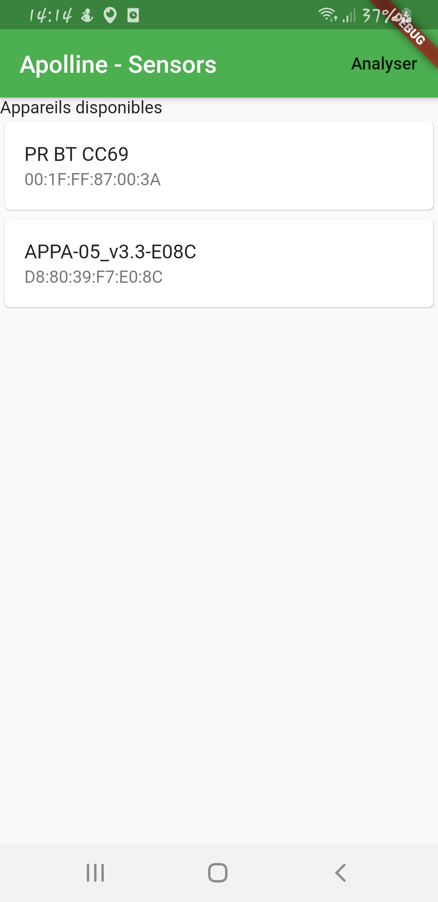
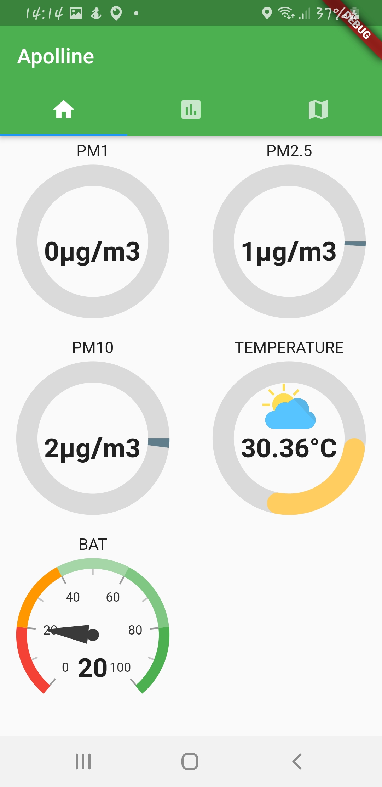
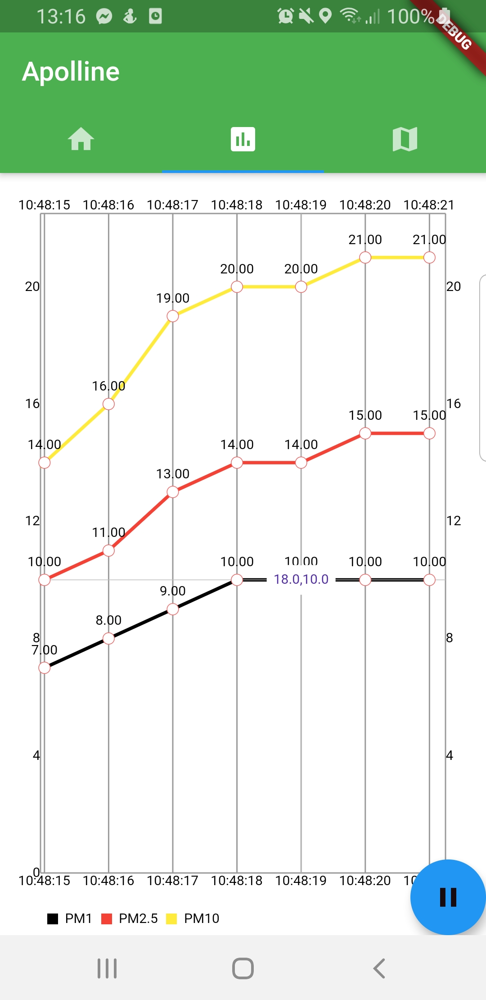
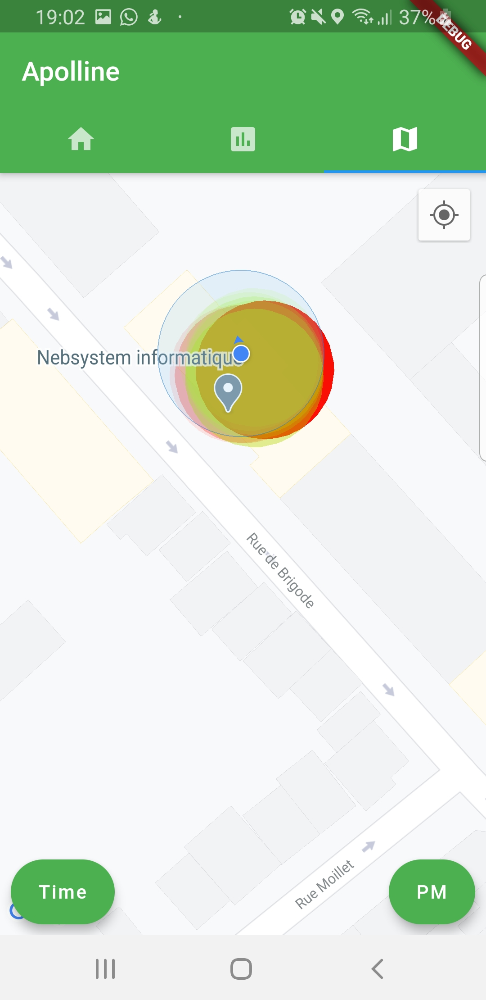
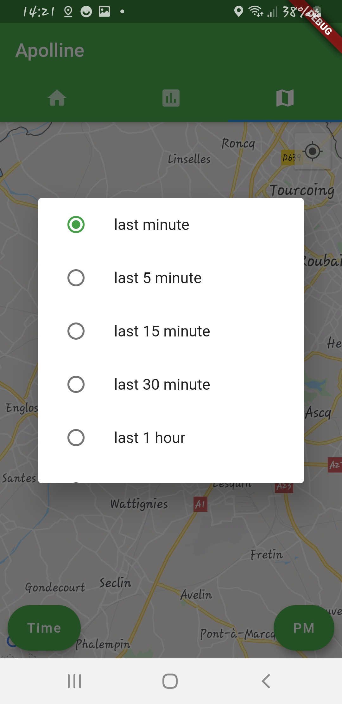

# Apolline - Flutter
Application multi-plateforme pour la collecte des mesures de l'air à l'aide d'un capteur

Capteur pris en charge:

 - [LOA](http://www-loa.univ-lille1.fr/) capteur.

## Langage
----------
Le langage utilisé est Dart avec le framework Flutter. Qui nous permet d'avoir un seul code source pour les versions Android et Ios.

## Build instructions

### Backend endpoint configuration

Before running the application, you MUST generate endpoint configuration by running:
```shell script
dart scripts/configuration_generation.dart
```
Then, you can set variables in the `apolline-flutter/assets/config_dev.json` file.

### Production build

#### Android

##### Manual build

1. Create a keystore with an upload key (https://flutter.dev/docs/deployment/android#create-an-upload-keystore);
2. Move the keystore file as `android/app/upload-keystore.jks`;
3. Create `android/key.properties` file as such:
```text
storeFile=upload-keystore.jks
storePassword=$KEYSTORE_STORE_PASSWORD
keyAlias=$KEYSTORE_KEY_ALIAS
keyPassword=$KEYSTORE_KEY_PASSWORD
```
4. Build the application with `flutter build apk` or `flutter build appbundle`.

##### Automated build

To make the CI build the application bundle and sign it, we need to upload it to GitHub as a secret.

1. Encode the store with base64: `gpg -c --armor release.keystore`;
2. Upload both `release.keystore.asc` and associated password as GitHub secrets;
3. Use them as such in your CI workflow:
```text
# Create store file from secret
echo "${{ secrets.UPLOAD_KEYSTORE }}" > upload.keystore.asc

# Decode store with encode key (the one you prompted with gpg -c)
gpg -d --passphrase "${{ secrets.UPLOAD_KEYSTORE_PASSPHRASE }}" --batch upload.keystore.asc > app/upload-keystore.jks
```

A Medium article describing the procedure can be found here: https://stefma.medium.com/how-to-store-a-android-keystore-safely-on-github-actions-f0cef9413784

### Captures d'écrans:

| | | |
|:-------------------------:|:-------------------------:|:-------------------------:|
||||
||||

<br/>

### Les librairies utilisées:
-------------------
- [flutter_blue](https://pub.dev/packages/flutter_blue) : Un plugin de Flutter pour se connecter et communiquer avec des appareils Bluetooth à faible consommation d'énergie, sur Android et iOS 
- [syncfusion_flutter_gauges](https://pub.dev/packages/syncfusion_flutter_gauges): La bibliothèque de jauges Syncfusion de Flutter contient des widgets de visualisation de données tels que la jauge radiale, qui est écrite en fléchette, pour créer des jauges modernes, interactives et animées.
- [get_it](https://pub.dev/packages/get_it): Un simple Service Locator direct qui permet de découpler l'interface d'une implémentation concrète et d'accéder à l'implémentation concrète de partout dans l'applciation.
- [mp_chart](https://pub.dev/packages/mp_chart): Un ensemble de cartes de Flutter tout comme AndroidMPChart, applique une carte facile à utiliser pour le Flutter.
- [google_maps_flutter](https://pub.dev/packages/google_maps_flutter):Un plugin Flutter pour l'intégration de Google Maps dans les applications iOS et Android. Utilisé pour le map de l'application.
- [flutter_launcher_icons](https://pub.dev/packages/flutter_launcher_icons): Un paquet qui simplifie la tâche de mise à jour de l'icône du lanceur de votre application Flutter.
- [http](https://pub.dev/packages/http): Une API composable, multi-plateforme et basée sur le futur pour les requêtes HTTP. Utilisé pour le influxDB.
- [sqflite](https://pub.dev/packages/sqflite): Un plugin de Flutter pour SQLite, un moteur de base de données SQL intégré, autonome et très fiable. Utilisé pour stocker les données en local.
- [geolocator](https://pub.dev/packages/geolocator): Un plugin de géolocalisation pour Flutter. Ce plugin fournit une API multi-plateforme (iOS, Android) pour les fonctions de localisation générique (GPS, etc.). Utilisé pour récupuer la position (longitude et longitude).
- [geohash](https://pub.dev/packages/geohash): Une simple bibliothèque de geohashing pour les fléchettes. Utilisé pour décoder et encoder la postion(longitude et longitude).
- [global_configuration](https://pub.dev/packages/global_configuration): Un paquet de Flutter pour gérer les différentes configurations et les rendre disponibles partout dans l'application.

<br/>

### Contributeurs
----------------
Ordre alphabétique des noms:

- BARRY Issagha
- GDISSA Ramy
- RADI Lina
- VIDOR Remi
