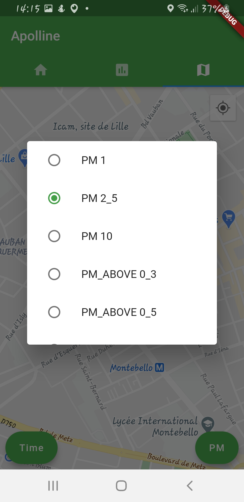

# Apolline - Flutter

Air quality measures gathering multi-platform application.

## Install

```shell
cd apolline-flutter
flutter pub get
dart scripts/configuration_generation.dart  # see backend endpoint configuration section below
flutter run
```

## Build instructions

### Backend endpoint configuration

Before running the application, you MUST generate endpoint configuration by running:
```shell script
dart scripts/configuration_generation.dart
```
Then, you can set variables in the `apolline-flutter/assets/config_dev.json` file.

### Production build

#### Android

##### CI build

On `develop` push, CI will build an APK and try to push it as beta release on the Play Store.

Before merging a branch on `develop`, make sure:
* release notes have been updated
* application version has been increased (minor/patch)

If you want to make a public release on Play Store, you must mark a previously-uploaded beta release
as ready for production in the Play console (https://play.google.com/console).

##### Manual build

1. Create a keystore with an upload key (https://flutter.dev/docs/deployment/android#create-an-upload-keystore);
2. Move the keystore file as `android/app/upload-keystore.jks`;
3. Create `android/key.properties` file as such:
```text
storeFile=upload-keystore.jks
storePassword=$KEYSTORE_STORE_PASSWORD
keyAlias=$KEYSTORE_KEY_ALIAS
keyPassword=$KEYSTORE_KEY_PASSWORD
```
4. Build the application with `flutter build apk` or `flutter build appbundle`.

##### Automated build

To make the CI build the application bundle and sign it, we need to upload it to GitHub as a secret.

1. Encode the store with base64: `gpg -c --armor release.keystore`;
2. Upload both `release.keystore.asc` and associated password as GitHub secrets;
3. Use them as such in your CI workflow:
```text
# Create store file from secret
echo "${{ secrets.UPLOAD_KEYSTORE }}" > upload.keystore.asc

# Decode store with encode key (the one you prompted with gpg -c)
gpg -d --passphrase "${{ secrets.UPLOAD_KEYSTORE_PASSPHRASE }}" --batch upload.keystore.asc > app/upload-keystore.jks
```

A Medium article describing the procedure can be found here: https://stefma.medium.com/how-to-store-a-android-keystore-safely-on-github-actions-f0cef9413784

## Supported sensors

- [LOA](http://www-loa.univ-lille1.fr/) sensor.

## Screenshots

| | | |
|:-------------------------:|:-------------------------:|:-------------------------:|
||||
||||

## Student contributors

- BARRY Issagha
- GDISSA Ramy
- RADI Lina
- VIDOR Remi
